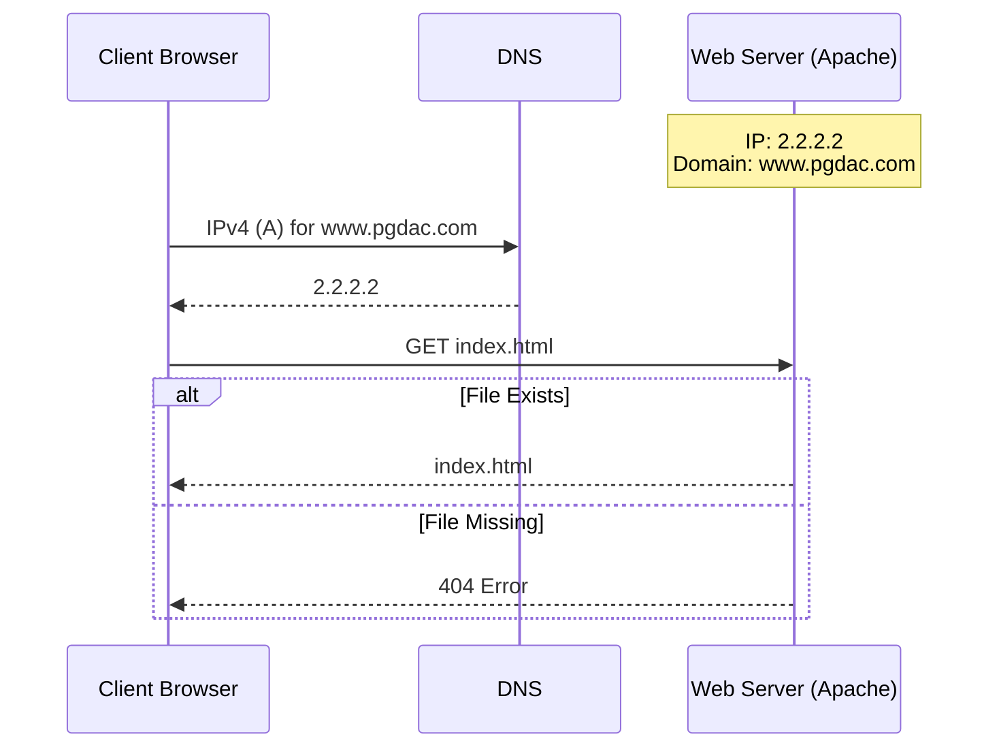

# Advanced Web Programming

## Website Setup Requirements
To set up a website, the following components are required:
*   **Website Contents**
*   **A Computer** (or web host)
*   **Web Server** software
*   **IP Address** (for public hosting)
*   **Domain Name** (for public hosting)
*   **Network Access**

## Software and Tools
*   **Server Stack**: XAMPP (Apache, MySQL, PHP, PHPMyAdmin).
*   **Libraries**: JQuery (file download).
*   **Editors**: Visual Studio Code or Notepad++ (NPP).
*   **Client**: Web Browser (Chrome, Firefox).
*   **Data Carrier**: XML/JSON.

## Website Architecture
*   **Static Contents**: HTML.
*   **Dynamic Contents**: PHP, JSP, ASP.
*   **Styling**: CSS.
*   **Effects/Local Access**: JavaScript, JQuery.
*   **Philosophy**: Mobile First Approach.

## Web Server Basics
*   **Software**: Apache is cited as the application software.
*   **Ports**: Default HTTP port is 80; Secure (TLS v1.3) port is 443.
*   **Mechanism**: Operates on a Request-Response method.
*   **Key Concepts**: Document Root, Directory Index.

### Client-Server Interaction Diagram
The following Mermaid diagram reconstructs the flow described in the source between the Client Browser, DNS, and Web Server (pgdac.com at 2.2.2.2).

