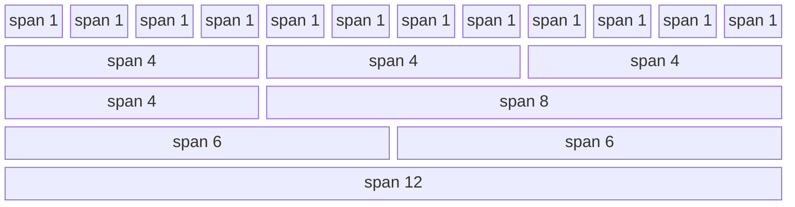

# Responsive Design

## Core Concepts
*   **Why?**: Motivation for responsive design.
*   **Tools**: Essential tools for development.
*   **Media Queries**: The mechanism for applying styles based on device characteristics.
*   **Fluid Images**: Ensuring images scale with the viewport.

## Syntax Example
```css
@media only screen and (max-width: 600px) {
  body {
    background-color: lightblue;
  }
}
```


## The Grid System
The source visualizes a grid layout system based on spanning columns. Below is a diagrammatic representation of the layout structure found in the document:



### Grid System Breakpoints
The following table details the class prefixes and container widths for different screen sizes:

| Property | Extra small (<576px) | Small (>=576px) | Medium (>=768px) | Large (>=992px) | Extra Large (>=1200px) | XXL (>=1400px) |
| :--- | :--- | :--- | :--- | :--- | :--- | :--- |
| **Class prefix** | `.col-` | `.col-sm-` | `.col-md-` | `.col-lg-` | `.col-xl-` | `.col-xxl-` |
| **Grid behaviour** | Horizontal at all times | Collapsed to start, horizontal above breakpoints | Collapsed to start, horizontal above breakpoints | Collapsed to start, horizontal above breakpoints | Collapsed to start, horizontal above breakpoints | Collapsed to start, horizontal above breakpoints |
| **Container width** | None (auto) | 540px | 720px | 960px | 1140px | 1320px |
| **Suitable for** | Portrait phones | Landscape phones | Tablets | Laptops | Laptops and Desktops | Laptops and Desktops |
| **# of columns** | 12 | 12 | 12 | 12 | 12 | 12 |
| **Gutter width** | 1.5rem | 1.5rem | 1.5rem | 1.5rem | 1.5rem | 1.5rem |

*Features applied to all sizes:* Nestable, Offsets available, Column ordering available.

### Size Classes Visual
The source depicts a visual bar showing nested columns:
*   **Container**: Yellow border
*   **Row**: Contains `col-8` (White/Grey split) and `col-4` (Green).
*   **Nested**: Inside the `col-8`, there are two `col-6` sections (one white, one grey).

